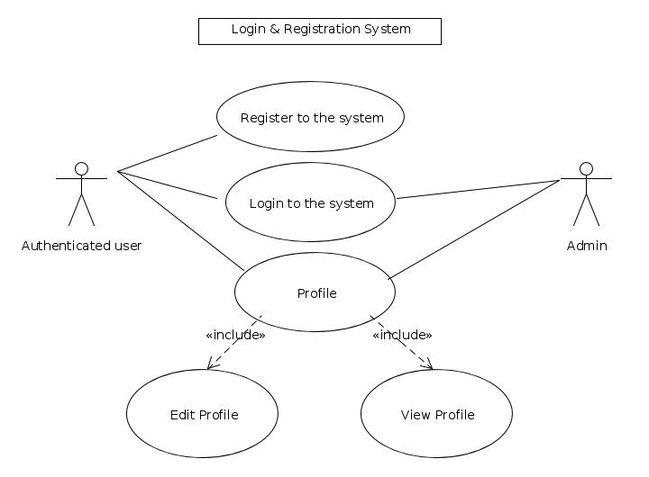

=======================
Behavioral Requirements
=======================

Behavioural requirements of the system are described using use case view. The Following use case diagrams summarize the functional and behavioural requirements of the Aakash Portal.

- Use case diagram of the Ticketing System 

- Use case diagram of the Login and Registration system 

- Use case diagram for Discussion Forum

Use case diagram of the Ticketing System
========================================

.. figure:: _static/img/TicketingSystem.jpg
   :height: 600 px
   :width: 900 px
   :scale: 50 %
   :alt: Use case diagram of the Ticketing System
   :align: center

Use case diagram of the Login and Registration system
=====================================================

Use case diagram for Discussion Forum
=====================================

.. figure:: _static/img/DiscussionForum.jpg
   :height: 600 px
   :width: 900 px
   :scale: 50 %
   :alt: Use case diagram for Discussion Forum
   :align: center
