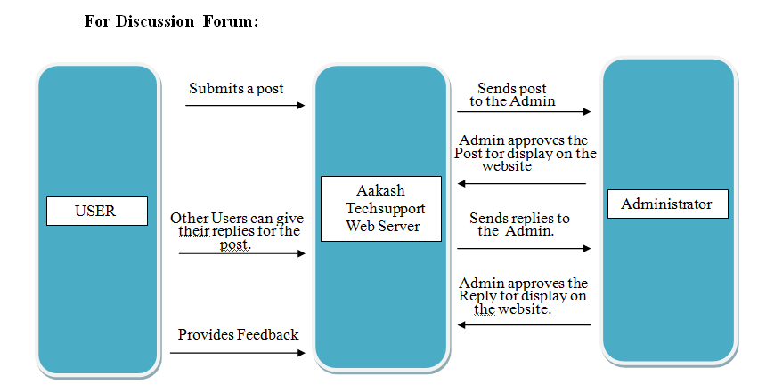
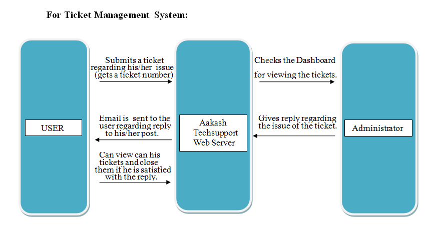
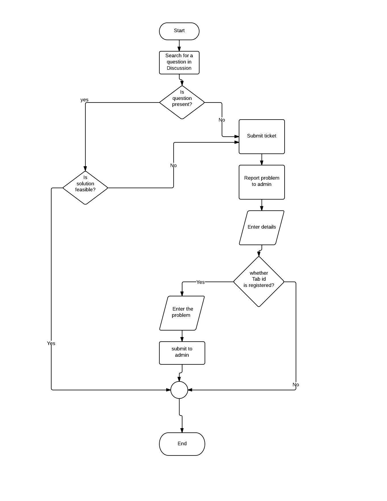
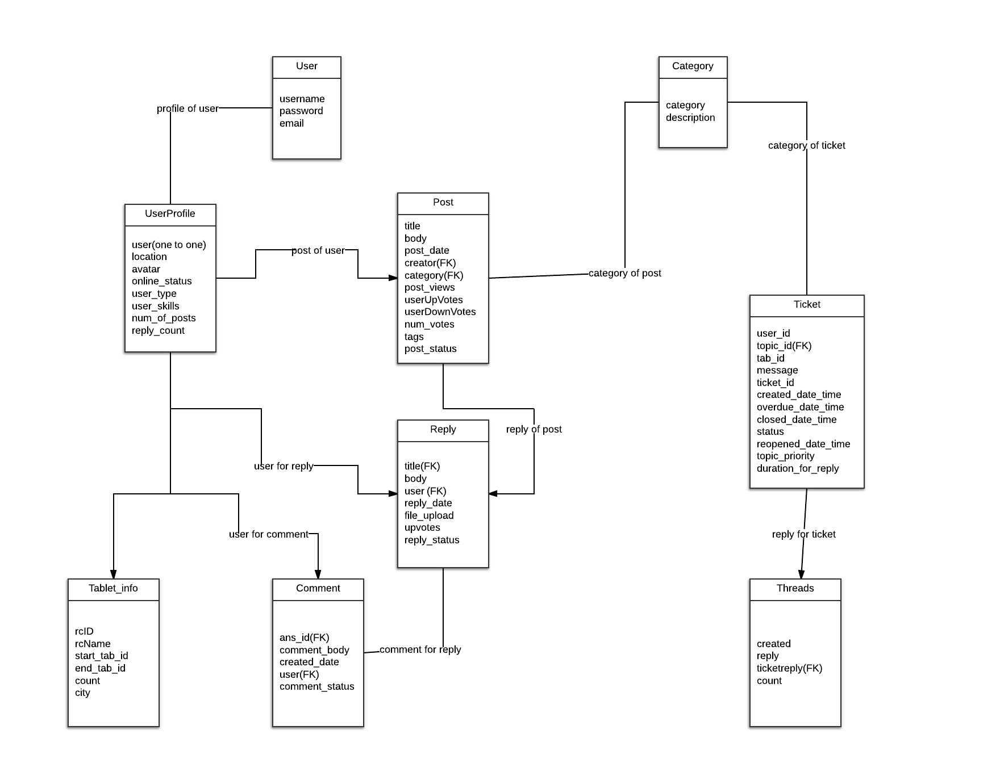

=========================
Diagrammatic Descriptions
=========================

Data Flow Diagrams for Aakash Tech Support Portal
=================================================

DFD for discussion forums
-------------------------

Data Flow Diagram for discussion forums

DFD for ticketing system
------------------------

DFD for ticketing system

Sequence Diagram for Reporting a Problem
========================================

Sequence Diagram for Reporting a Problem

Flow Chart for Reporting a Problem
==================================

Flow Chart for Reporting a Problem

Entity relationship diagram
===========================

ER Diagram for Database

